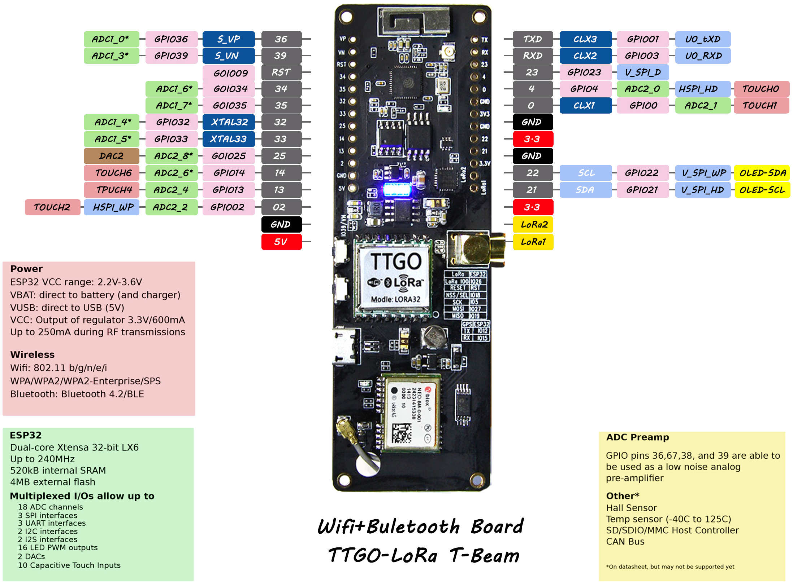
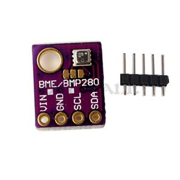
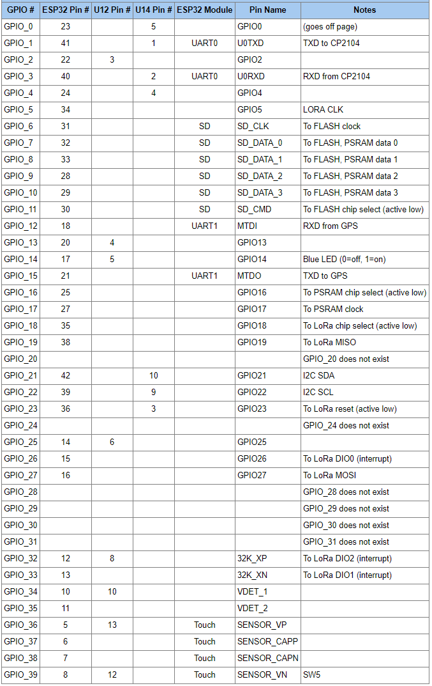

# Car / bike GPS tracker with TTGO-T-Beam & A6 GPRS module
### Using ESP32 + LoRa + A6 GPRS module

## Libraries needed

- [ESP32 Core for Arduino](https://github.com/espressif/arduino-esp32/blob/master/docs/arduino-ide/boards_manager.md) (installation with Boards Manager)
- [TinyGPS++](https://github.com/mikalhart/TinyGPSPlus)
- [CayenneLPP](https://github.com/sabas1080/CayenneLPP)
- [BME280-I2C-ESP32](https://github.com/Takatsuki0204/BME280-I2C-ESP32)
	- Delete / uninstall original Adafruit BME280 library after installing this, otherwise it will cause conflicts

## Instructions

You need to connect the [T-Beam](https://github.com/LilyGO/TTGO-T-Beam) DIO1 pin marked *Lora1* to the *pin 33* - So that the ESP32 can read that output from the Lora module.
Optionally you can also connect the *Lora2* output to *GPIO 32*, but this is not needed here.

You can program the T-Beam using the [Arduino ESP32](https://github.com/espressif/arduino-esp32) board `Heltec_WIFI_LoRa_32`.

### Update `config.h`

Update with your own [TTN keys](https://www.thethingsnetwork.org/docs/devices/registration.html).

## Hardware

- **TTGO-T-Beam**
	- ESP32 + GPS + LoRa



- **A6 GSM/GPRS module**
	- For places without LoRaWAN coverage - via SMS


- **BME/BMP280 module** (optional)
	- For reporting of temperature, humidity and atmospheric pressure inside the car




## Reference

### TTGO T-Beam Pin Map



### Specifications
```
ESP32
  ESP32 Version REV1
  WiFi
  Bluetooth 
  4MB Flash
  3D Antenna
 
LORA
  Working voltage:      1.8 ~ 3.7v
  Acceptable current:   10 ~ 14mA
  Transmit current:     120mA @ +20dBm
                         90mA @ +17dBm
                         29mA @ +13dBm
  Operating frequency:  433MHz / 868MHz / 915MHz
  Transmit power:       +20dBm
  Receive sensitivity:  -139dBm @ LoRa &  62.5 KHz & SF=12 &  146bps
                        -136dBm @ LoRa & 125 KHz   & SF=12 &  293bps
                        -118dBm @ LoRa & 125 KHz   & SF=6  & 9380bps
                        -123dBm @ FSK  &   5 KHz   & 1.2Kbps
  Frequency error:       +/-15KHz
  FIFO space:            64 byte
  Data rate:             1.2K ~ 300Kbps @ FSK
                         0.018K ~ 37.5Kbps @ LoRa        
  Modulation Mode:       FSK, GFSK, MSK, GMSK, LoRa TM, OOK
  Interface form:        SPI
  Sleep current:         0.2uA @ SLEEP
                         1.5uA @ IDLE
  Operating temperature: -40℃ - +85℃
  Digital RSSI function
  Automatic frequency correction
  Automatic gain control 
  RF wake-up function
  Low voltage detection and temperature sensor
  Fast wake-up and frequency hopping
  Highly configurable data packet handler

GPS
  GPS modules NEO-6M, 3V-5V power supply Universal
  Destined module with ceramic antenna, signal super
  Save the configuration parameter data EEPROM Down
  With data backup battery
  There are LED signal indicator
  Default Baud Rate: 9600

Power
  IP5306 2A Battery PMIC
  LED, Blue - User controller
  LED, Red - GPS 1PPS
  LED, Red/green - battery charged/power on
  Button, reset switch
  Button, user readable
  Switch, power on/battery charge
  USB
  CP2104-GMR
```

## Further improvement

You are welcome to contribute to this project in any way. Suggestions/feedback is much appreciated.

## Credits

- Thanks to DeuxVis for his [Lora-TTNMapper-T-Beam](https://github.com/DeuxVis/Lora-TTNMapper-T-Beam)